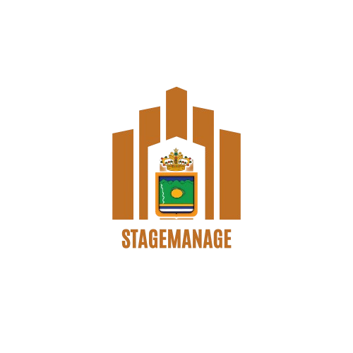

# STAGEMANAGE

This project was generated with [Angular CLI](https://github.com/angular/angular-cli) version 18.1.4.

## Description

StageManage est une application web Angular conçue pour la gestion des projets, des stages, et des stagiaires. Elle offre des fonctionnalités d'authentification, des tableaux de bord interactifs, et une gestion efficace des fichiers téléchargés.

## Development Server

Run `ng serve` for a dev server. Navigate to `http://localhost:4200/`. The application will automatically reload if you change any of the source files.

## Code Scaffolding

Run `ng generate component component-name` to generate a new component. You can also use `ng generate directive|pipe|service|class|guard|interface|enum|module`.

## Build

Run `ng build` to build the project. The build artifacts will be stored in the `dist/` directory.

## Running Unit Tests

Run `ng test` to execute the unit tests via [Karma](https://karma-runner.github.io).

## Running End-to-End Tests

Run `ng e2e` to execute the end-to-end tests via a platform of your choice. To use this command, you need to first add a package that implements end-to-end testing capabilities.

## Structure du Répertoire

- **public/** : Contient les fichiers statiques (images, PDFs, favicon).
- **src/** : Contient les sources du projet Angular.
  - **app/** : Composants et services de l'application.
  - **auth/** : Gestion de l'authentification.
  - **base/** : Composants de base comme le pied de page et la barre de navigation.
  - **dashboard/** : Tableaux de bord pour projets et stagiaires.
  - **projects/** : Gestion des projets.
  - **stages/** : Gestion des stages.
  - **stagiaire/** : Gestion des stagiaires.
  - **services/** : Services Angular.
- **templates/** : Modèles pour les documents.
- **uploads/** : Répertoire pour les fichiers téléchargés.
- **angular.json** : Configuration Angular.
- **db.json** : Base de données JSON utilisée pour le stockage des données.
- **server.js** et **server.ts** : Serveur backend pour la gestion des requêtes.
- **package.json** : Dépendances du projet.

## Prérequis

Avant de commencer, assurez-vous d'avoir les outils suivants installés sur votre machine :

- [Node.js](https://nodejs.org/) (version LTS recommandée)
- [Angular CLI](https://angular.io/cli) (`npm install -g @angular/cli`)

## Installation

1. Clonez le dépôt :

   git clone <https://github.com/votre-utilisateur/STAGEMANAGE.git>

2. Accédez au répertoire du projet :

    cd stagemanage

3. Installez les dépendances :

    npm install

4. Démarrez le serveur backend :

    node server.js
    json-server --watch db.json

5. Démarrez application Angular :

    ng serve

## Utilisation

Authentification : Gérer les utilisateurs et les sessions via le module authentification.
Tableaux de bord : Accéder aux tableaux de bord pour consulter les informations sur les projets et les stagiaires.
Gestion des projets : Créer, modifier et supprimer des projets.
Gestion des stages : Suivre les stages en cours et à venir.
Gestion des stagiaires : Ajouter, mettre à jour et supprimer les informations des stagiaires.
Contribuer

## Licence

Ce projet est sous la Licence MIT.

## Auteurs

**Abderrahim OUAHAB** :
Pour toute question ou problème, veuillez ouvrir une issue sur le dépôt GitHub,ou contactez moi.

Merci d\'utiliser StageManage. Nous espérons qu\'il répondra à vos besoins !

### Notes

- **Exécution des serveurs** : Les instructions clarifient que les commandes pour démarrer le serveur backend et la base de données JSON doivent être exécutées dans des terminaux séparés.
